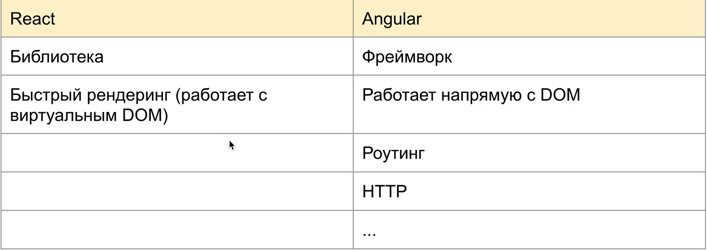
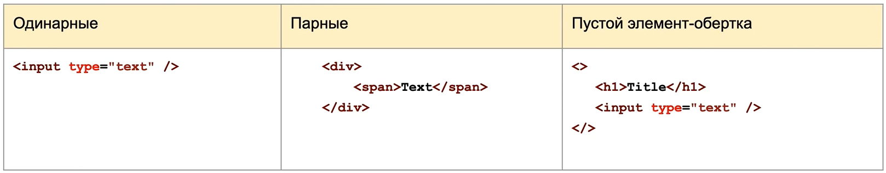
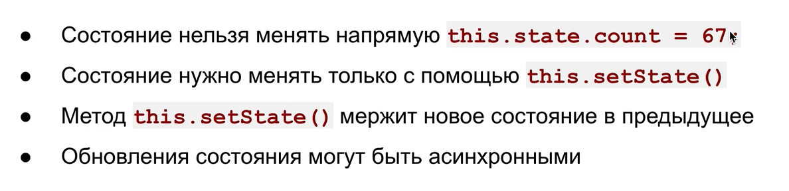
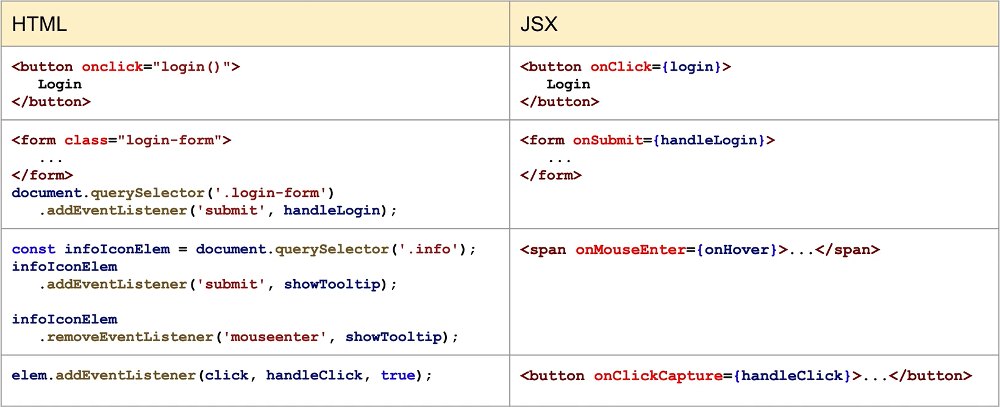
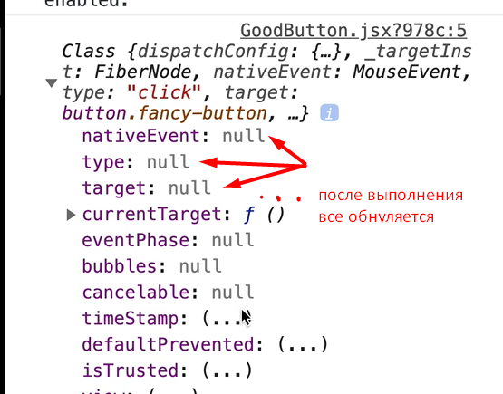
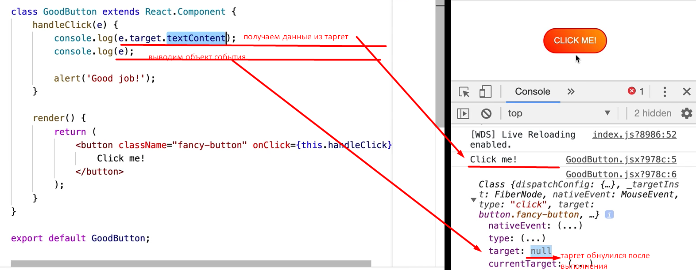
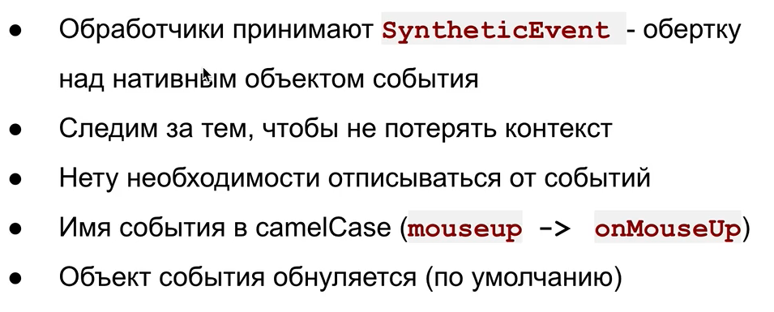
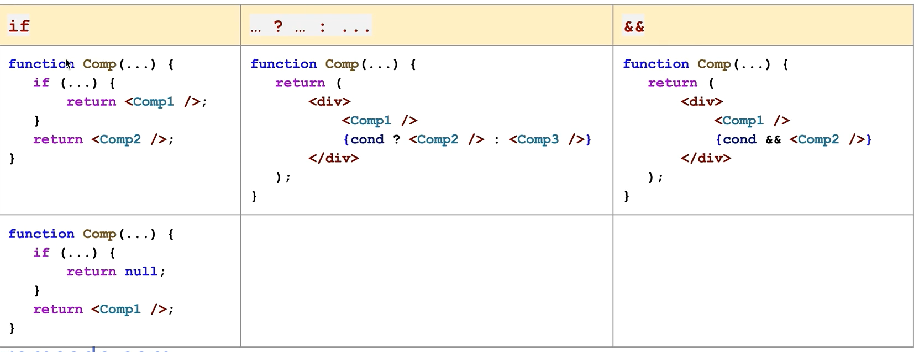
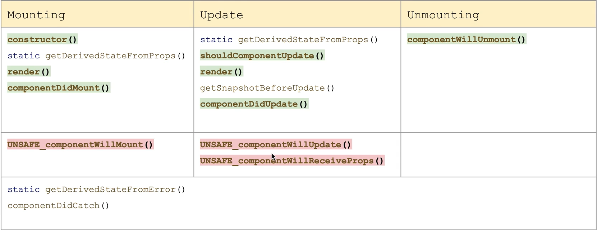
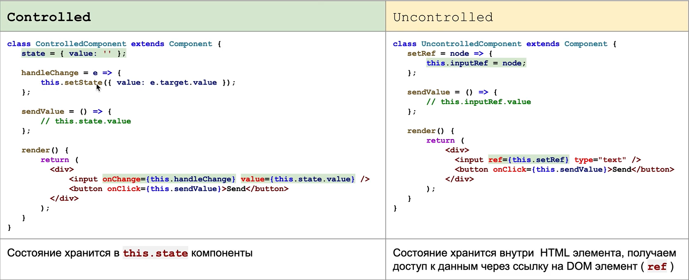

# REACT

## ABSTRACT

## Table of Contents

1. [Lesson1_React-intro](#React-intro)
1. [Lesson2_JSX](#JSX)
1. [Lesson3_Components](#COMPONENTS)
1. [Lesson4_State](#State)
1. [Lesson5_Events](#Events)
1. [Lesson6_Conditional_Render](#Conditional_Render)
1. [Lesson7_LISTS](#LISTS_KEY)
1. [Lesson8_Lifecycle_methods](#LIFECYCLE_METHODS)
1. [Lesson9_Forms](#FORMS)

## React-intro

Технологии с помощью которых можно писать приложения делятся на две группы:

- библиотеки (решают какую-то одну конкретную задачу);
- фреймворки (набор инструментов)
  

REACT это библиотека, которая позволяет отрисовывать данные на страничке

## JSX

JSX это расширение синтаксиса JS, которое чтобы превратить в обычный JS нужно прогнать через BABEL.



```javascript
import React from 'react'; // обязательно импортируем реакт в наши файлы JSX
import ReactDom from 'react-dom';
```

## COMPONENTS

Компоненты - это небольшие кусочки нашено кода. Бывают двух видов:

- **_функциональные_**;
- **_классовые_**
  Чтобы использовать классовые обязательно унаследоваться от класса Component из библиотеки React и обьявить метод render

```javascript
import React, { Component } from 'react';

class Counter extends Component {
  render() {
    return <div></div>;
  }
}
```

Компонента App - так чаще всего в реакт приложениях называется корневой компонент

```javascript
import React from 'react';
import ReactDom from 'react-dom';
import App from './App';
import './index.scss';

const rootElement = document.querySelector('#root');

ReactDom.render(<App />, rootElement);
```

### **_Варианты работы с props_**

Ниже три абсолютно идентичных варианта передачи данных в пропс
//============================

```javascript
const Greeting = (props) => {
  if (props.isLoggedIn) {
  }
};
```

//=============================

```javascript
// зачастую в props приходит не одно свойство и в таких случаях удобно использовать деструктуризацию
const Greeting = (props) => {
  const { isLoggedIn } = props;
  if (isLoggedIn) {
  }
};
```

//==============================

```javascript
// или использовать деструктуризацию прямо в аргументах
const Greeting = ({ isLoggedIn }) => {
  if (isLoggedIn) {
  }
};
```

## State

У РЕАКТА есть несколько особенностей по которым он совершает re-render компоненту (т.е. компонента изменилась и реакт должен об этом узнать и соответствующим образом изменить DOM, который мы видим в браузере у себя на страничке).

### Способы re-rendera component

- Передать новые props _(об этом будет дальше)_
- Вызвать this.forceUpdate() - используется крайне редко и больше для каких-то внутренних реализаций;
- Вызвать this.setState() - устанавливает новое значение состояния компоненты. **_Есть только у классовых компонент_**;
  Задать состояние компоненту мы можем в конструкторе. Свойства (props) мы тоже передаем в конструктор и обязательно в супер()

```javascript
class Counter extends Component {
  // * *конструктор выполняется один раз в момент создания представителя класса*
  constructor(props) {
    super(props);
    // если наследуемся от какого-то класса не забываем вызывать родительский конструктор с помощью метода super()
    // частая ошибка изменять свойства, которые пришли через props.  Например props.start = props.start + 1 делать нельзя. Свойства никогда не меняем, менять состояние можно только с помощью метода setState()
    this.state = {
      // в this.state задаем данные которые нам нужны для отрисовки экрана
      counter: 0, // начальное значение
      // counter: props.start, // начальное значение если передаем его с помощью props
    };
    // после создания this.state мы в любых методах можем тспользовать свойство this.state.counter

    // setInterval() используется в демонстрационных целях, а в целом плохая практика передавать его в конструктор
    setInterval(() => {
      // состояние изменяется с помощью метода this.setState, в который мы передаем объект с теми свойствами, которые хотим изменить
      this.setState({
        counter: this.state.counter + 1,
      });
    }, 1000);
  }
  // метод setState() заставляет реакт перерендериться и обновить компонентув DOM
  render() {
    return <div>{this.state.counter}</div>;
  }
}
```

Если мы не передаем ничего в конструктор и нам не нужны пропс, то this.state можно передать следующим образом

```javascript
class Page extends React.Component {
  state = {
    text: null,
  };
  render() {
    return ();
  }
}
```



## Events



Все события в реакт по умолчанию срабатывают на этапе всплытия, если нам нужно чтобы обработчик сработал **на этапе погружения**, то к событию добавляется capture в кэмэлкейс (onClickCapture)
**Отписываться** от обработчиков в реакте не нужно, реакт об этом заботится сам

- **_инлайновый способ назначения обработчика_** (может подойти если у нас простенькая функция)

```javascript
const GoodButton = () => {
  return (
    <button
      className="fancy-button"
      // обработчик onClick, указываем ф-цию, т.к обработчик события это всегда ф-ция.
      onClick={() => alert('Good job!')}
    >
      Click me!
    </button>
  );
};
```

- **_назначение обработчика в классовой компоненте_**
  Объявление обработчика как метод класса

```javascript
class GoodButton extends React.Component {
  handleClick() {
    alert('Good job!');
  }
  render() {
    return (
      // получаем ссылку на метод handleClick через this
      <button className="fancy-button" onClick={this.handleClick}>
        Click me!
      </button>
    );
  }
}
```

Обработчики события в реакт, так же как и обработчики повешанные на обычные ДОМэлементы, **получают в аргумент объект события**.

```javascript
 handleClick(e) {
    console.log(e);
    alert('Good job!');
  }
```

Если вывести его в консоль, то можно увидеть, что в нем много всяких свойств. Это специальный объект SyntheticEvent, кроссбраузерная обёртка над нативным экземпляром события. У неё такой же интерфейс, как и у нативного события, включая методы stopPropagation() и preventDefault(). Эта обёртка помогает событиям работать одинаково во всех браузерах.

Нужно обратить внимание, что после того как какой-то обработчик обработал событие все свойства обнуляются


**_Примеры привязки контекста_**

```javascript
class Counter extends React.Component {
  constructor(props) {
    super(props);
    this.state = {
      counter: 0,
    };
    this.decrement = this.decrement.bind(this);
  }
  // привязываем контекст выше в конструкторе с помощью bind
  decrement() {
    this.setState({
      counter: this.state.counter - 1,
    });
  }
  // контекст привязывается автоматически (самый оптимальный способ)
  increment = () => {
    this.setState({
      counter: this.state.counter + 1,
    });
  };
  reset() {
    this.setState({
      counter: 0,
    });
  }
  render() {
    return (
      <div className="counter">
        <button
          data-action="decrease"
          className="counter__button"
          onClick={this.decrement}
        >
          -
        </button>
        {/* третий способ привязки контекста это свойство стрелочной ф-ции, что не имеет свой контекст и использует внешний контекст. 
		В нем обязательно вызвать this.reset() */}
        <span className="counter__value" onClick={() => this.reset()}>
          {this.state.counter}
        </span>
        <button
          data-action="increase"
          className="counter__button"
          onClick={this.increment}
        >
          +
        </button>
      </div>
    );
  }
}
```



## Conditional_Render



## LISTS_KEY

Если нам нужно весь объект разобрать и закинуть как свойство в какую-то компоненту (здесь в примере name, age, но может быть намного больше свойств)

```javascript
const users = [
  {
    age: 21,
    name: 'Bob',
  },
  {
    age: 17,
    name: 'Tom',
  },
];
```

```javascript
const User = ({ name, age }) => {
  return (
    <li className="user">
      <span className="user__name">{name}</span>
      <span className="user__age">{age}</span>
    </li>
  );
};
```

можно записать так

```javascript
const UserList = ({ users }) => {
  return (
    <ul className="users">
      {users.map((user) => (
        <User key={user.name} name={user.name} age={user.age} />
      ))}
    </ul>
  );
};
```

а можно упростить запись и воспользоваться деструктуризацией. Т.е. что делает запись внизу. Она берет все свойства объекта user и прокидывает их как свойство в компоненту где мы деструктурируем объект

```javascript
const UserList = ({ users }) => {
  return (
    <ul className="users">
      {users.map((user) => (
        <User key={user.name} {...user} />
      ))}
    </ul>
  );
};
```


## LIFECYCLE_METHODS

МЕТОДЫ ЖИЗНЕННОГО ЦИКЛА - нужны для того чтобы в приложениях отловить моменты когда компонента рендерится или до того как она отрендерилась, или момент когда она уходит со страницы чтобы сделать какую-то очистку данных


**устаревшие методы жизненного цикла выделены красным\*
**основные методы для работы с жизненным циклом выделены зеленым\*
Три стадии жизненного цикла:

#### **_Mounting_** - когда компонента попадает, т.е. отрисовывается первый раз на странице

- **_constructor()_** срабатывает при инициализации компоненты, т.е. когда она создается
- **_render()_** срабатывает после constructor()
- **_componentDidMount()_** не принимает никакие аргументы и срабатывает в тот момент когда компонента попала на страницу. После render() это один из самых используемых методов, в нем делаются подписки на какие-то внешние события, запросы в базу за данными

#### **_Update_** - когда у компоненты изменяется props или состояние

- **_shouldComponentUpdate(nextProps, nextState)_** - принимает nextProp и nextState, запускается перед render() на Update стадии, т.е когда компонента маунтится он не отрабатывает, но когда у нее меняется состояние и какие-то пропсы он отрабатывает. В зависимости от того как изменились пропертис или стейт этот компонент принимает решение запускать или не запускать рендер, т.е в основном существует для оптимизации.
  **Должен возвращать булевое значение**
- **_componentDidUpdate(prevProps, prevState)_** - принимает prevProps, prevState.

#### **_Unmounting_** - когда компонента уходит со страницы

- **_componentWillUnmount()_** - не принимает никакие аргументы, существует для очистки какой-то информации (память, подписки и т.д.)

Есть такое соглашение, что первым в компоненте пишется конструктор, в самом конце рендер, а методы жизненного цикла пишутся между ними в порядке как они вызываются вначале componentDidMount(), в конце componentWillUnmount(), а между ними разные апдейты shouldComponentUpdate(), componentDidUpdate(). Свои собственные пользовательские методы мы объявляем между рендером и методами жизненного цикла

```javascript
class Life extends Component {
  constructor() {}
  componentDidMount() {}
  shouldComponentUpdate(nextProps, nextState) {
    return true;
  }
  componentDidUpdate(prevProps, prevState) {}
  componentWillUnmount() {}

  // here put users methods

  render() {}
}
```

## FORMS

При работе с формами есть два подхода:
- ***сontrolled*** состояние инпутов/формы хранится в state компоненты. В данном случае за состояние полей инпутов, состояние полей ввода, за их сохранение отвечает Реакт компонента. 
*данные состояния инпута храним в state = { value: '' }; инпут через value получает данные из state и непосредственно отображает эти данные на страничке. И все изменения состояния, которые пользователь делает с этим инпутом (ввод каких-то значений в текстовое поле) через обработчик onChange c помощью метода handleChange сохраняются в state*

- ***uncontrolled*** состояние инпутов хранится непосредственно в html элементов

В РЕАКТприложениях предпочтительнее сontrolled подход.

```javascript

```

<!-- <a name="types--primitives"></a><a name="1.1"></a>
  - [1.1](#types--primitives) **Primitives**: When you access a primitive type you work directly on its value.

    - `string`
    - `number`
    - `boolean`
    - `null`
    - `undefined`
    - `symbol`
    - `bigint`

    ```javascript
    const foo = 1;
    let bar = foo;

    bar = 9;

    console.log(foo, bar); // => 1, 9
    ```

    - Symbols and BigInts cannot be faithfully polyfilled, so they should not be used when targeting browsers/environments that don’t support them natively.

  <a name="types--complex"></a><a name="1.2"></a>
  - [1.2](#types--complex)  **Complex**: When you access a complex type you work on a reference to its value.

    - `object`
    - `array`
    - `function`

    ```javascript
    const foo = [1, 2];
    const bar = foo;

    bar[0] = 9;

    console.log(foo[0], bar[0]); // => 9, 9
    ```

**[⬆ back to top](#table-of-contents)**

## References

  <a name="references--prefer-const"></a><a name="2.1"></a>
  - [2.1](#references--prefer-const) Use `const` for all of your references; avoid using `var`. eslint: [`prefer-const`](https://eslint.org/docs/rules/prefer-const), [`no-const-assign`](https://eslint.org/docs/rules/no-const-assign)

    > Why? This ensures that you can’t reassign your references, which can lead to bugs and difficult to comprehend code.

    ```javascript
    // bad
    var a = 1;
    var b = 2;

    // good
    const a = 1;
    const b = 2;
    ```

  <a name="references--disallow-var"></a><a name="2.2"></a>
  - [2.2](#references--disallow-var) If you must reassign references, use `let` instead of `var`. eslint: [`no-var`](https://eslint.org/docs/rules/no-var)

    > Why? `let` is block-scoped rather than function-scoped like `var`.

    ```javascript
    // bad
    var count = 1;
    if (true) {
      count += 1;
    }

    // good, use the let.
    let count = 1;
    if (true) {
      count += 1;
    }
    ```

  <a name="references--block-scope"></a><a name="2.3"></a>
  - [2.3](#references--block-scope) Note that both `let` and `const` are block-scoped, whereas `var` is function-scoped.

    ```javascript
    // const and let only exist in the blocks they are defined in.
    {
      let a = 1;
      const b = 1;
      var c = 1;
    }
    console.log(a); // ReferenceError
    console.log(b); // ReferenceError
    console.log(c); // Prints 1
    ```

    In the above code, you can see that referencing `a` and `b` will produce a ReferenceError, while `c` contains the number. This is because `a` and `b` are block scoped, while `c` is scoped to the containing function.

**[⬆ back to top](#table-of-contents)**

    ```javascript
    // bad
    const items = new Array();
    ``` -->
