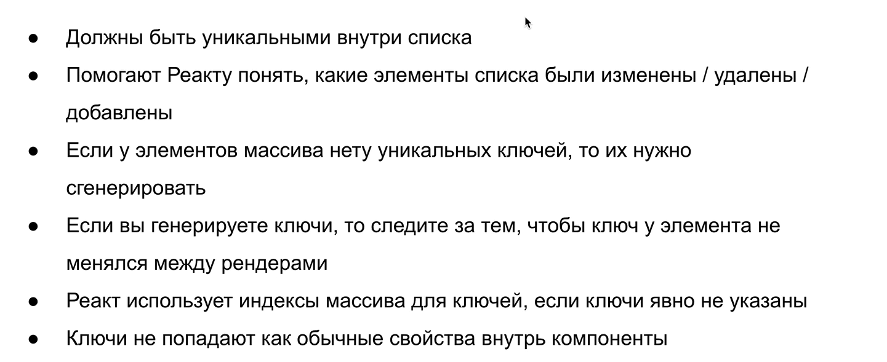
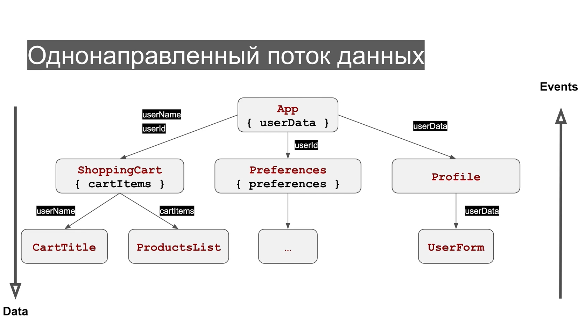

# REACT

## ABSTRACT

## Table of Contents

1. [Lesson1_React-intro](#React-intro)
1. [Lesson2_JSX](#JSX)
1. [Lesson3_Components](#COMPONENTS)
1. [Lesson4_State](#State)
1. [Lesson5_Events](#Events)
1. [Lesson6_Conditional_Render](#Conditional_Render)
1. [Lesson7_LISTS](#LISTS_KEY)
1. [Lesson8_Lifecycle_methods](#LIFECYCLE_METHODS)
1. [Lesson9_Forms](#FORMS)
1. [Lesson10_Lifting_state_up](#Lifting_state_up)
1. [Lesson11_Component_update](#Component_update)
1. [Lesson12_Practice](#Practice)
1. [Lesson13_React_Router](#React_Router)
1. [Lesson14_React_Hooks](#React_Hooks)

## React-intro

Технологии с помощью которых можно писать приложения делятся на две группы:

- библиотеки (решают какую-то одну конкретную задачу);
- фреймворки (набор инструментов)
  

REACT это библиотека, которая позволяет отрисовывать данные на страничке

## JSX

JSX это расширение синтаксиса JS, которое чтобы превратить в обычный JS нужно прогнать через BABEL.


```javascript
import React from 'react'; // обязательно импортируем реакт в наши файлы JSX
import ReactDom from 'react-dom';
```

## COMPONENTS

Компоненты - это небольшие кусочки нашено кода. Бывают двух видов:

- **_функциональные_**;
- **_классовые_**
  Чтобы использовать классовые обязательно унаследоваться от класса Component из библиотеки React и обьявить метод render

```javascript
import React, { Component } from 'react';

class Counter extends Component {
  render() {
    return <div></div>;
  }
}
```

Компонента App - так чаще всего в реакт приложениях называется корневой компонент

```javascript
import React from 'react';
import ReactDom from 'react-dom';
import App from './App';
import './index.scss';

const rootElement = document.querySelector('#root');

ReactDom.render(<App />, rootElement);
```

### **_Варианты работы с props_**

Ниже три абсолютно идентичных варианта передачи данных в пропс
//============================

```javascript
const Greeting = props => {
  if (props.isLoggedIn) {
  }
};
```

//=============================

```javascript
// зачастую в props приходит не одно свойство и в таких случаях удобно использовать деструктуризацию
const Greeting = props => {
  const { isLoggedIn } = props;
  if (isLoggedIn) {
  }
};
```

//==============================

```javascript
// или использовать деструктуризацию прямо в аргументах
const Greeting = ({ isLoggedIn }) => {
  if (isLoggedIn) {
  }
};
```

## State

У РЕАКТА есть несколько особенностей по которым он совершает re-render компоненту (т.е. компонента изменилась и реакт должен об этом узнать и соответствующим образом изменить DOM, который мы видим в браузере у себя на страничке).

### Способы re-rendera component

- Передать новые props _(об этом будет дальше)_
- Вызвать this.forceUpdate() - используется крайне редко и больше для каких-то внутренних реализаций;
- Вызвать this.setState() - устанавливает новое значение состояния компоненты. **_Есть только у классовых компонент_**;
  Задать состояние компоненту мы можем в конструкторе. Свойства (props) мы тоже передаем в конструктор и обязательно в супер()

```javascript
class Counter extends Component {
  // * *конструктор выполняется один раз в момент создания представителя класса*
  constructor(props) {
    super(props);
    // если наследуемся от какого-то класса не забываем вызывать родительский конструктор с помощью метода super()
    // частая ошибка изменять свойства, которые пришли через props.  Например props.start = props.start + 1 делать нельзя. Свойства никогда не меняем, менять состояние можно только с помощью метода setState()
    this.state = {
      // в this.state задаем данные которые нам нужны для отрисовки экрана
      counter: 0, // начальное значение
      // counter: props.start, // начальное значение если передаем его с помощью props
    };
    // после создания this.state мы в любых методах можем тспользовать свойство this.state.counter

    // setInterval() используется в демонстрационных целях, а в целом плохая практика передавать его в конструктор
    setInterval(() => {
      // состояние изменяется с помощью метода this.setState, в который мы передаем объект с теми свойствами, которые хотим изменить
      this.setState({
        counter: this.state.counter + 1,
      });
    }, 1000);
  }
  // метод setState() заставляет реакт перерендериться и обновить компонентув DOM
  render() {
    return <div>{this.state.counter}</div>;
  }
}
```

Если мы не передаем ничего в конструктор и нам не нужны пропс, то this.state можно передать следующим образом

```javascript
class Page extends React.Component {
  state = {
    text: null,
  };
  render() {
    return ();
  }
}
```


## Events


Все события в реакт по умолчанию срабатывают на этапе всплытия, если нам нужно чтобы обработчик сработал **на этапе погружения**, то к событию добавляется capture в кэмэлкейс (onClickCapture)
**Отписываться** от обработчиков в реакте не нужно, реакт об этом заботится сам

- **_инлайновый способ назначения обработчика_** (может подойти если у нас простенькая функция)

```javascript
const GoodButton = () => {
  return (
    <button
      className="fancy-button"
      // обработчик onClick, указываем ф-цию, т.к обработчик события это всегда ф-ция.
      onClick={() => alert('Good job!')}
    >
      Click me!
    </button>
  );
};
```

- **_назначение обработчика в классовой компоненте_**
  Объявление обработчика как метод класса

```javascript
class GoodButton extends React.Component {
  handleClick() {
    alert('Good job!');
  }
  render() {
    return (
      // получаем ссылку на метод handleClick через this
      <button className="fancy-button" onClick={this.handleClick}>
        Click me!
      </button>
    );
  }
}
```

Обработчики события в реакт, так же как и обработчики повешанные на обычные ДОМэлементы, **получают в аргумент объект события**.

```javascript
 handleClick(e) {
    console.log(e);
    alert('Good job!');
  }
```

Если вывести его в консоль, то можно увидеть, что в нем много всяких свойств. Это специальный объект SyntheticEvent, кроссбраузерная обёртка над нативным экземпляром события. У неё такой же интерфейс, как и у нативного события, включая методы stopPropagation() и preventDefault(). Эта обёртка помогает событиям работать одинаково во всех браузерах.

Нужно обратить внимание, что после того как какой-то обработчик обработал событие все свойства обнуляются


**_Примеры привязки контекста_**

```javascript
class Counter extends React.Component {
  constructor(props) {
    super(props);
    this.state = {
      counter: 0,
    };
    this.decrement = this.decrement.bind(this);
  }
  // привязываем контекст выше в конструкторе с помощью bind
  decrement() {
    this.setState({
      counter: this.state.counter - 1,
    });
  }
  // контекст привязывается автоматически (самый оптимальный способ)
  increment = () => {
    this.setState({
      counter: this.state.counter + 1,
    });
  };
  reset() {
    this.setState({
      counter: 0,
    });
  }
  render() {
    return (
      <div className="counter">
        <button data-action="decrease" className="counter__button" onClick={this.decrement}>
          -
        </button>
        {/* третий способ привязки контекста это свойство стрелочной ф-ции, что не имеет свой контекст и использует внешний контекст. 
		В нем обязательно вызвать this.reset() */}
        <span className="counter__value" onClick={() => this.reset()}>
          {this.state.counter}
        </span>
        <button data-action="increase" className="counter__button" onClick={this.increment}>
          +
        </button>
      </div>
    );
  }
}
```


## Conditional_Render


## LISTS_KEY

Если нам нужно весь объект разобрать и закинуть как свойство в какую-то компоненту (здесь в примере name, age, но может быть намного больше свойств)

```javascript
const users = [
  {
    age: 21,
    name: 'Bob',
  },
  {
    age: 17,
    name: 'Tom',
  },
];
```

```javascript
const User = ({ name, age }) => {
  return (
    <li className="user">
      <span className="user__name">{name}</span>
      <span className="user__age">{age}</span>
    </li>
  );
};
```

можно записать так

```javascript
const UserList = ({ users }) => {
  return (
    <ul className="users">
      {users.map(user => (
        <User key={user.name} name={user.name} age={user.age} />
      ))}
    </ul>
  );
};
```

а можно упростить запись и воспользоваться деструктуризацией. Т.е. что делает запись внизу. Она берет все свойства объекта user и прокидывает их как свойство в компоненту где мы деструктурируем объект

```javascript
const UserList = ({ users }) => {
  return (
    <ul className="users">
      {users.map(user => (
        <User key={user.name} {...user} />
      ))}
    </ul>
  );
};
```



## LIFECYCLE_METHODS

МЕТОДЫ ЖИЗНЕННОГО ЦИКЛА - нужны для того чтобы в приложениях отловить моменты когда компонента рендерится или до того как она отрендерилась, или момент когда она уходит со страницы чтобы сделать какую-то очистку данных


**устаревшие методы жизненного цикла выделены красным\*
**основные методы для работы с жизненным циклом выделены зеленым\*
Три стадии жизненного цикла:

#### **_Mounting_** - когда компонента попадает, т.е. отрисовывается первый раз на странице

- **_constructor()_** срабатывает при инициализации компоненты, т.е. когда она создается
- **_render()_** срабатывает после constructor()
- **_componentDidMount()_** не принимает никакие аргументы и срабатывает в тот момент когда компонента попала на страницу. После render() это один из самых используемых методов, в нем делаются подписки на какие-то внешние события, запросы в базу за данными

#### **_Update_** - когда у компоненты изменяется props или состояние

- **_shouldComponentUpdate(nextProps, nextState)_** - принимает nextProp и nextState, запускается перед render() на Update стадии, т.е когда компонента маунтится он не отрабатывает, но когда у нее меняется состояние и какие-то пропсы он отрабатывает. В зависимости от того как изменились пропертис или стейт этот компонент принимает решение запускать или не запускать рендер, т.е в основном существует для оптимизации.
  **Должен возвращать булевое значение**
- **_componentDidUpdate(prevProps, prevState)_** - принимает prevProps, prevState.

#### **_Unmounting_** - когда компонента уходит со страницы

- **_componentWillUnmount()_** - не принимает никакие аргументы, существует для очистки какой-то информации (память, подписки и т.д.)

Есть такое соглашение, что первым в компоненте пишется конструктор, в самом конце рендер, а методы жизненного цикла пишутся между ними в порядке как они вызываются вначале componentDidMount(), в конце componentWillUnmount(), а между ними разные апдейты shouldComponentUpdate(), componentDidUpdate(). Свои собственные пользовательские методы мы объявляем между рендером и методами жизненного цикла

```javascript
class Life extends Component {
  constructor() {}
  componentDidMount() {}
  shouldComponentUpdate(nextProps, nextState) {
    return true;
  }
  componentDidUpdate(prevProps, prevState) {}
  componentWillUnmount() {}

  // here put users methods

  render() {}
}
```

## FORMS

При работе с формами есть два подхода:

- **_сontrolled_** состояние инпутов/формы хранится в state компоненты. В данном случае за состояние полей инпутов, состояние полей ввода, за их сохранение отвечает Реакт компонента.
  _данные состояния инпута храним в state = { value: '' }; инпут через value получает данные из state и непосредственно отображает эти данные на страничке. И все изменения состояния, которые пользователь делает с этим инпутом (ввод каких-то значений в текстовое поле) через обработчик onChange c помощью метода handleChange сохраняются в state_

- **_uncontrolled_** состояние инпутов хранится непосредственно в html элементов

В РЕАКТприложениях предпочтительнее сontrolled подход.


Важно задавать начальное состояние инпутов, иначе компоненты будут uncontrolled по умолчанию.
Большинство инпутов работают также как в HTML, есть некоторые отличия. Например select, в HTML мы отмеченный элемент маркаем как selected, то в Реакте в value просто надо передать отмеченный


## Lifting_state_up

Обмен данными между компонентами:

1. Однонаправленный поток данных (unidirectional data flow)
   
   Приложение на Реакт выглядит как дерево компонент. Есть компонента которая рендерится в начале с помощью РеактДом (App) и затем отрисовывает какие-то другие компоненты (ShoppingCart, Preferences, Profile). Каждая из этих компонент может хранить в себе данные в состоянии this.state, откуда может передавать данные своим подкомпонентам (from ShoppingCart to CartTitle and ProductsList)
   Если userData, необходима всем компонентам или большинству, то ее логично хранить в верхнем уровне. В Реакте однонаправленный поток и нет возможности обмениваться в любом порядке данными, данные падают сверху вниз.
   Мы можем закинуть из App данные в ShoppingCart, но если мы ожидаем, что компонента ShoppingCart будет выполнять какие-то действия с этими данными, то мы должны забросить в нее и функцию-колбэк из App, с помощью которой измененные данные вернутся обратно.

**_ДАННЫЕ ПАДАЮТ ВНИЗ ЧЕРЕЗ PROPS ОБРАТНО МЫ МОЖЕМ ЗАКИНУТЬ ИХ ЧЕРЕЗ КОЛБЭКИ ЧЕРЕЗ EVENTS_**
если упростить вышеуказанную схему и избавиться от всех компонент, условно у нас есть какое-то состояние и есть компоненты, которые отрисовывают наш UI. Из состояния данные падают в UI, на страничке пользователь выполняет какие-то действия (что-то кликает, набирает, возвращает) и через колбэки эти данные возвращаются обратно и изменяют состояние, затем когда изменилось состояние Реакт понимает, что надо перерисовать UI. Таким образом и получается однонаправленный поток данных
 2) Поднятие состояния (lifting state) 3)

## Component_update

```javascript

import React from 'react';
import TodoList from './TodoList';

// Этапы
// создадим UI
// Добавим интерактивность
// Наладим общение с сервером

const App = () => {
  return <TodoList />;
};
export default App;
import React from 'react';
import TasksList from './TasksList';

const TodoList = () => {
  return (
    <>
      <h1 className="title">Todo List</h1>
      <TasksList />
    </>
  );
};
export default TodoList;

import React from 'react';
// на кнопку повешаем обработчик, который при нажатии на кнопку возьмет текст с инпута и создаст с ним задачу
// чтобы сделать состояние инпута контролируемым добавляем state
// и в конце очищаем наш инпут this.setState({ value: '' });
class CreateTaskInput extends React.Component {
  state = {
    value: '',
  };

  handleChange = event => {
    this.setState({
      value: event.target.value,
    });
  };

  handleTaskCreate = () => {
    this.props.onCreate(this.state.value);
    this.setState({ value: '' });
  };

  render() {
    return (
      <div className="create-task">
        <input
          className="create-task__input"
          type="text"
          value={this.state.value}
          onChange={this.handleChange}
        />
        <button className="btn create-task__btn" onClick={this.handleTaskCreate}>
          Create
        </button>
      </div>
    );
  }
}

export default CreateTaskInput;

// 1. take text from input
// 2 create task with this text
// 3. add created task to the list


import React from 'react';
import CreateTaskInput from './CreateTaskInput';
import Task from './Task';

// выше нам список задач не нужен, поэтому здесь сохраняем его в состоянии state и переделываем компоненту на классовую
// в состояние запишем наши задачи
// c помощью метода map отрисуем наши задачи в список и вынесем его в отдельную компоненту
// обязательно всем элементам раздать ключи key={task.id}. Ключи присваиваем в том месте где будет отрисовываться элемент, т.е. в TasksList, а не в компоненте Task, где мы создаем лишки
// для checkbox нужно указать состояние. У checkbox в Реакт есть нюанс, его состояние записывается не в value, a в свойство defaultChecked
// {...task} === (id={task.id} done={task.done} text={task.text})
// tasks хранятся у нас в state, чтоы добавить новую таску создаем переменную const newTask и с помощью метода concat объединяем ее
// со старыми в переменной updatedTasks. Устанавливаем в состояние this.setState({ tasks: updatedTasks })
// запишем данные на сервер с помощью fetch
const baseUrl = 'https://62e3f5a5c6b56b45117f936b.mockapi.io/api/v1/tasks';
class TasksList extends React.Component {
  state = {
    tasks: [],
  };

  onCreate = text => {
    // 1. Create task object
    // 2. Post object to server
    // 3. Fetch list from server
    // const { tasks } = this.state;
    const newTask = {
      id: this.state.tasks.length + 1,
      text,
      done: false,
    };

    fetch(baseUrl, {
      method: 'POST',
      headers: {
        'Content-Type': 'application/json;utc-8',
      },
      body: JSON.stringify(newTask),
    }).then(response => {
      if (response.ok) {
        fetch(baseUrl)
          .then(res => {
            if (res.ok) {
              return res.json();
            }
          })
          .then(tasksList => {
            this.setState({
              tasks: tasksList,
            });
          });
      } else {
        throw new Error('Faild to create task');
      }
    });
    // const updatedTasks = tasks.concat(newTask);
    // this.setState({ tasks: updatedTasks });
  };

  handleTaskStatusChange = id => {
    // 1. Find task in a list (для этого надо пройти по tasks: и когда найдем нужную задачу, то переключить ее состояние)
    // 2. Toggle done value
    // 3. Save updated list
    const updatedTasks = this.state.tasks.map(task => {
      if (task.id === id) {
        return {
          ...task,
          done: !task.done,
        };
      }
      return task;
    });
    this.setState({ tasks: updatedTasks });
  };

  handleTaskDelete = id => {
    // 1. Filter tasks
    // 2. Update state
    const updatedTasks = this.state.tasks.filter(task => task.id !== id);
    this.setState({ tasks: updatedTasks });
  };

  render() {
    const sortedList = this.state.tasks.slice().sort((a, b) => a.done - b.done);
    return (
      <main className="todo-list">
        <CreateTaskInput onCreate={this.onCreate} />
        <ul className="list">
          {sortedList.map(task => (
            <Task
              key={task.id}
              {...task}
              onDelete={this.handleTaskDelete}
              onChange={this.handleTaskStatusChange}
            />
          ))}
        </ul>
      </main>
    );
  }
}

export default TasksList;

```

## Practice

```javascript

```

```javascript

```

## React_Router


Single page application
**_react-router-dom_** это библиотека (поможет для создания сайта с несколькими страницами)

- механизм для переключения страниц
- считывание данных с URL строки
- работа с историей переходов по сайту

Для установки необходимо установить зависимость _npm i -S react-router-dom_ и импортировать Router _import {Router} from 'react-router-dom'_.
При этом в библиотеке есть **_4 разных роутера_**:

<BrowserRouter> - чаще всего используется в данный момент для обычной навигации по сайту. Состояние приложения, которое сейчас отображается синхронизируется с URL в адресной строке.
Для работы с <BrowserRouter> нам его также нужно импортировать в наш файл _import {BrowserRouter} from 'react-router-dom'_.
<MemoryRouter> - покрывает специфические кейсы, с его помощью мы тоже можем определенным образом навигироваться по сайту, но при этом не меняется URL. Исходя из названия, мы можем понять, где находится пользователь в данный момент (location хранится в оперативной памяти)

### Работа с BrowserRouter (первая часть роутинга)

На страничке все что относится к навигации нашего приложения должно находиться по дереву компонент внутри <BrowserRouter></BrowserRouter>, все что мы расположим вне этой компоненты работать не будет. И внутри <BrowserRouter> у нас должны размещаться Routes (их тоже нужно импортировать из react-router-dom), в которые мы заворачиваем каждую страничку и внутри которых в свойстве path прописываем пути по которым будут отображаться наши странички.
При этом может появиться проблема, что корневая страница, путь к которой указывается просто / (слэшом), потом будет отрисовываться и с другими страницами в пути которых есть / (/products), чтобы пофиксить это нужно в роут главной страницы добавить свойство exact.
Затем все наши роуты нужно обернуть в структуру <Switch></Switch>

```javascript
import React from 'react';
import { BrowserRouter, Route, Switch } from 'react-router-dom';
import Contacts from './Contacts';
import Home from './Home';
import Products from './Products';

const App = () => (
  <div className="page">
    <BrowserRouter>
      <Switch>
        <Route exact path="/">
          <Home />
        </Route>
        <Route path="/products">
          <Products />
        </Route>
        <Route path="/contacts">
          <Contacts />
        </Route>
      </Switch>
    </BrowserRouter>
  </div>
);
```

### Навиация (вторая часть роутинга)

Если в чистом HTML мы переходим по ссылкам с помощью тэга <a></a>,то когда мы строим SPA и используем 'react-router-dom' для приложения, то нам понадобится компонента Link из этой библиотеки. При переходе по ссылкам в этом случае не происходит перезагрузка страницы

```javascript
import React from 'react';
import { Link } from 'react-router-dom';

const Contacts = () => {
  return (
    <div className="page__content">
      <h1>Contacts</h1>
      <Link to="/">Go home</Link>
    </div>
  );
};
```

Чтобы при загрузке страницы на каком то некорневом пути у нас нормально отрисовывался сайт нужен дополнительный html (типо /products.html), но так как у нас html один, то нужна надстройка для webpack.config, которая укажет серверу, что наш файл лежит в корне и мы работаем с ним:

```javascript
devServer: {
      historyApiFallback: true,
    },
```

Если мы перейдем по какому то пути которого у нас нет, мы можем с помощью роута сделать что-то в духе 404ошибки, при этом он должен находиться в конце списка, так как звездочка указывает, что это любой путь и компонента <Switch> его будет всегда показывать, поэтому если мы разместим этот роут первым, то к другим файлам мы не сможем перейти

```javascript
<Route path="*">
  <PageNotFound />
</Route>
```

Для более глубокого роутинга нам нужно, в компоненте с которой будет проходить дальнейший роут в линки передать куда именно мы будем переходить. Кроме этого, в роут нужно прописать статический и дальнейший URL (параметр через двоеточие) (<Route path="/products/:productId" />) и компоненту с которой будет выполняться переход.
Чтобы считать информацию, которую мы передаем через URL, компоненту Product передаем в роут не как дочерний элемент, а в свойство component={Product}

```javascript
import React from 'react';
import { Route, Link, Switch } from 'react-router-dom';
import Product from './Product';

const Products = () => (
  <div className="page__content">
    <h1>Products</h1>
    <ul className="navigation">
      <li className="navigation__item">
        <Link to="/products/book">Book</Link>
      </li>
      <li className="navigation__item">
        <Link to="/products/ball">Ball</Link>
      </li>
    </ul>
    <Switch>
      <Route exact path="/products">
        // будет отображаться до того, как мы выберем продукт
        <span>Select a product please</span>
      </Route>
      <Route path="/products/:productId" component={Product} />
    </Switch>
  </div>
);
```

После того как мы передали компоненту Product напрямую в роут <Route path="/products/:productId" component={Product} /> роут предоставляет ей некоторые дополнительные свойства (передаем через пропс с помощью рест и можем вывести в консоль чтобы изучить), через которые мы можем получить информацию для навигации, для дальнейшей работы с URL.

```javascript
const Product = ({ ...rest }) => {
  console.log(rest);
  return <div className="product">ball</div>;
};
```

Например в свойстве match есть свойство params (формируется, когда мы через двоеточие передаем path="/products/:productId" все что после второго слэша будет попадать в productId), в котором есть все параметры из URL.


Теперь мы можем сразу деструктурировать свойство компонента и вместо рест вывести match и вместо продукта уже из свойства params получим значение productId

```javascript
const Product = ({ match }) => (
  <div className="product">{`Product is ${match.params.productId}`}</div>
);
```

Также при написании длинных путей в роут мы можем сформировать путь с помощью данных из match **_только не забываем, что компоненту Products нужно передать в свойство component в Route_**

```javascript
const Products = ({ match }) => (
  <div className="page__content">
    <h1>Products</h1>
    <ul className="navigation">
      <li className="navigation__item">
        <Link to={`${match.url}/book`}>Book</Link>
      </li>
      <li className="navigation__item">
        <Link to={`${match.url}/ball`}>Ball</Link>
      </li>
    </ul>
  </div>
);
```

Здесь нам также в вебпак конфиг (если мы его настраиваем вручную, а не через create app) нужна надстройка, потому что наше приложение снова не понимает путь (не находит html), с которого ему нужно брать информацию publicPath: '/' - будет отправлять все запросы в корневой каталог откуда ему нужно брать информацию

```javascript
  output: {
     filename: 'bundle.js',
     publicPath: '/',
   },
```

## React_Hooks

Не так давно в библиотеке реакт появились хуки и один из них useParams реализован в библиотеке реакт-роутер-дом. С его помощью мы можем доставать параметры в наших компонентах даже без использования вышеописанного подхода

<!-- <a name="types--primitives"></a><a name="1.1"></a>
  - [1.1](#types--primitives) **Primitives**: When you access a primitive type you work directly on its value.

    - `string`
    - `number`
    - `boolean`
    - `null`
    - `undefined`
    - `symbol`
    - `bigint`

    ```javascript
    const foo = 1;
    let bar = foo;

    bar = 9;

    console.log(foo, bar); // => 1, 9
    ```

    - Symbols and BigInts cannot be faithfully polyfilled, so they should not be used when targeting browsers/environments that don’t support them natively.

  <a name="types--complex"></a><a name="1.2"></a>
  - [1.2](#types--complex)  **Complex**: When you access a complex type you work on a reference to its value.

    - `object`
    - `array`
    - `function`

    ```javascript
    const foo = [1, 2];
    const bar = foo;

    bar[0] = 9;

    console.log(foo[0], bar[0]); // => 9, 9
    ```

**[⬆ back to top](#table-of-contents)**

## References

  <a name="references--prefer-const"></a><a name="2.1"></a>
  - [2.1](#references--prefer-const) Use `const` for all of your references; avoid using `var`. eslint: [`prefer-const`](https://eslint.org/docs/rules/prefer-const), [`no-const-assign`](https://eslint.org/docs/rules/no-const-assign)

    > Why? This ensures that you can’t reassign your references, which can lead to bugs and difficult to comprehend code.

    ```javascript
    // bad
    var a = 1;
    var b = 2;

    // good
    const a = 1;
    const b = 2;
    ```

  <a name="references--disallow-var"></a><a name="2.2"></a>
  - [2.2](#references--disallow-var) If you must reassign references, use `let` instead of `var`. eslint: [`no-var`](https://eslint.org/docs/rules/no-var)

    > Why? `let` is block-scoped rather than function-scoped like `var`.

    ```javascript
    // bad
    var count = 1;
    if (true) {
      count += 1;
    }

    // good, use the let.
    let count = 1;
    if (true) {
      count += 1;
    }
    ```

  <a name="references--block-scope"></a><a name="2.3"></a>
  - [2.3](#references--block-scope) Note that both `let` and `const` are block-scoped, whereas `var` is function-scoped.

    ```javascript
    // const and let only exist in the blocks they are defined in.
    {
      let a = 1;
      const b = 1;
      var c = 1;
    }
    console.log(a); // ReferenceError
    console.log(b); // ReferenceError
    console.log(c); // Prints 1
    ```

    In the above code, you can see that referencing `a` and `b` will produce a ReferenceError, while `c` contains the number. This is because `a` and `b` are block scoped, while `c` is scoped to the containing function.

**[⬆ back to top](#table-of-contents)**

    ```javascript
    // bad
    const items = new Array();
    ``` -->
